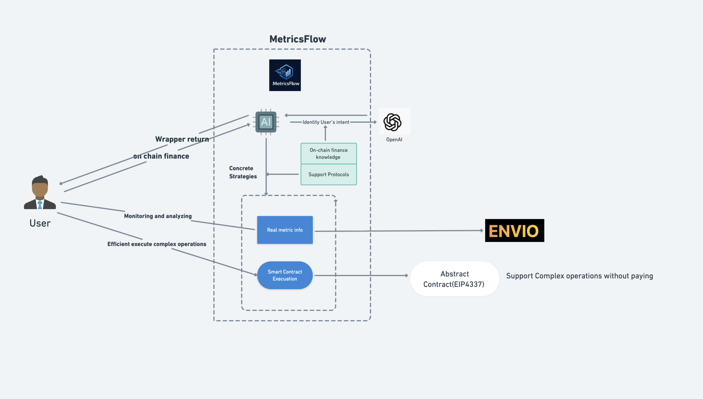
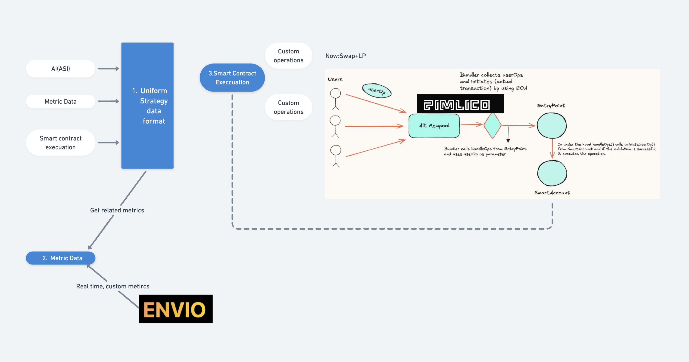
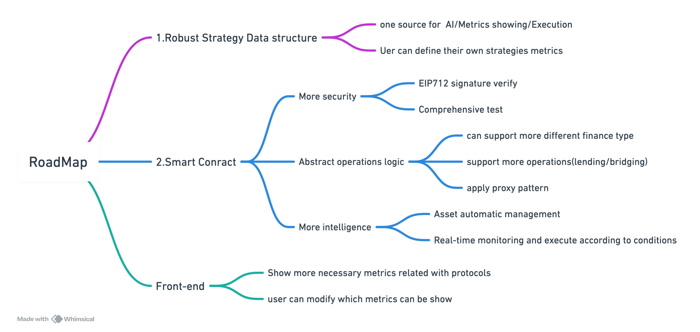

# MetricsFlow

Helping different level users analyze cutomed strategies by leveraging AI along with core instriciate metric data for primitive defi protols or defi lego and support one-clieck efficiency for complex operations

**For now, Only support arbitrum.Before interact with smart Contract, guarantee or deposit enough gas(1 dollar is ok)**

## 1. Background

The DeFi market has matured significantly with the emergence of diverse protocols including AMMs, lending platforms, route aggregators, and automated yield optimization strategies. However, significant gaps remain for both retail and institutional users, from beginners to experienced traders.

The proliferation of protocols within each category creates increasing complexity. Even within the same protocol type, mechanisms can vary substantially - for instance, Uniswap v3's introduction of concentrated liquidity fundamentally changed AMM dynamics. This complexity creates substantial barriers for newcomers.

Cross-chain functionality remains a persistent challenge. Liquidity fragmentation across different blockchains increases execution costs and complicates optimal strategy selection, even for experienced users and institutions.

While attractive yield opportunities exist across various protocols, users face persistent risks including smart contract vulnerabilities, extreme market conditions, and malicious projects that can result in significant losses.

Given the conceptual complexity and dynamic market conditions, even institutional investors and seasoned traders struggle to effectively analyze risk-return profiles and execute custom strategies efficiently.

All of these factors create barriers to wider on-chain finance adoption.

## 2. Solution

WorkFlow

How to made

This protocol empowers users and institutions to develop comprehensive understanding of their risk profiles and investment strategies. By leveraging AI-driven analysis of real-time market data and sophisticated protocol metrics, users can dynamically assess risks and opportunities across DeFi protocols. The platform provides modular DeFi building blocks that enable users to construct customized strategies aligned with their specific objectives.

**For Researchers**: Construct sophisticated strategies using primitive building blocks or advanced composable modules, with simulation capabilities to validate research hypotheses and strategy performance.

**For Beginners**: Access intuitive metrics and educational tools that demystify DeFi mechanisms, providing clear risk-return analysis to facilitate informed decision-making and learning progression.

**For Experienced Users**: Monitor existing strategies with real-time protocol metrics, identify emerging opportunities, and optimize risk-adjusted returns through advanced analytics.

**For Institutions**: Deploy customized strategy modules tailored to institutional requirements, such as capital preservation, stable yield generation, or risk-controlled growth strategies for large-scale deployments.

## Core Features

### 1. AI-Powered Strategy Assistant

Leveraging comprehensive protocol metrics and real-time market data, the AI assistant provides personalized strategy recommendations based on user intent and risk preferences. Rather than offering black-box solutions, the system provides transparent explanations of underlying mechanisms, risk factors, and expected outcomes, enabling informed decision-making.

### 2. Key metrics

Protocol-specific metrics dashboard displaying critical performance indicators tailored to each DeFi category:

-   **AMMs**: Slippage tolerance, price impact, liquidity depth, volume trends
-   **Lending Protocols**: Utilization rates, borrowing costs, liquidation thresholds, reserve factors
-   **Yield Farms**: APY breakdown, impermanent loss risk, token emission schedules
-   **Cross-chain Bridges**: Transfer fees, confirmation times, security audits

### 3. Modular DeFi Building Blocks

| Component               | Function                        | Example Protocols        | Required Inputs              | Generated Outputs              | Primary Risk Vectors            |
| ----------------------- | ------------------------------- | ------------------------ | ---------------------------- | ------------------------------ | ------------------------------- |
| **Token Swap**          | Execute atomic token exchanges  | Uniswap, Curve, Maverick | Token pair, amount, slippage | Swapped tokens, tx receipt     | Slippage, MEV, price impact     |
| **Lending Position**    | Supply assets for yield         | Aave, Compound, Morpho   | Asset, amount, duration      | Interest-bearing tokens        | Protocol risk, rate volatility  |
| **Borrowing Position**  | Access leverage via collateral  | Aave, Compound, Euler    | Collateral, target asset     | Borrowed assets, debt position | Liquidation, interest rate risk |
| **Liquidity Provision** | Provide DEX liquidity           | Uniswap, Curve, Balancer | Token pair, amounts, range   | LP tokens, fee earnings        | Impermanent loss, range risk    |
| **Yield Optimization**  | Automated strategy execution    | Yearn, Convex, Pendle    | Base asset, strategy type    | Strategy tokens, rewards       | Smart contract, strategy risk   |
| **Derivatives Trading** | Directional exposure management | GMX, Synthetix, dYdX     | Collateral, position size    | Leveraged position             | Liquidation, funding costs      |

cross-chain plugin if needed

### 4. Simple and efficient execution

Apply Account Abstraction (EIP-4337) to simplify complex smart contract interactions and help users efficiently execute their strategies.

## 3. Core componets

1. [metric-flow-ai](https://github.com/sodexx7/MetricFlow/tree/metric-flow-ai-agent)
2. [SmartContract Desgin](SmartContract.md)
3. [front-end](https://github.com/sodexx7/MetricFlow/tree/front-end)
4. [metric_envio_indexer](https://github.com/sodexx7/MetricFlow/tree/metric_envio_indexer)

#### Current Stage

Only support arbtrium uniswap -v3 [ARBITRUM_WETH_USDC_500_POOL](https://arbiscan.io/address/0xC6962004f452bE9203591991D15f6b388e09E8D0)

### 4. Setup

1. Use the deployed smart contract or deploy new smart contract.
2. Run metric-flow-ai-agent and make sure it is properly connected to the agent service.
3. Deploy Envio and verify that the host services are working correctly.
4. Run the front end locally.

### Q&A

#### What challenges did you solve, and how?

**1. How to Integrate AI, Metric Data Monitoring, and Smart Contract Execution?**

One of the main challenges was figuring out how to make AI, metric data monitoring, and smart contract execution work together to meet specific user demands — for example, showing only the defined metrics of supported protocols and exposing only their available operations.

When AI outputs strategies that involve specific protocols, the system must merge the AI output with the supported protocols, producing a standardized strategy data structure.
This structure can then be used by the metric monitoring system. For example:

Metric monitoring retrieves the protocol’s available metrics.

It then queries real-time metric data from Envio.

Envio provides the flexibility to define and implement any custom metric logic based on raw data.

For smart contract execution, if the standardized strategy includes a supported protocol, the smart contract panel will automatically display the corresponding protocol information along with its available operations for users.

This tight integration between AI strategy, metric data, and smart contract operations ensures that only valid and relevant data and actions are exposed to the user.

**2. How to achive efficiency Implementation of Complex Operations in Smart Contracts?**

Step 1 — Abstract Contract Design:
Using an Abstract Contract (EIP-4337), defined the complex operation functions.
In accordance with the abstract contract requirements, should also implement:

Signature verification logic

Essential supporting logic, such as maintaining the relationship between users and the smart contract

Step 2 — Handling Protocol Diversity:
Different on-chain financial protocols have different characteristics. Even within the same protocol type, implementations can vary.
This presents a major challenge — not only integrating multiple protocols but also requiring a deep understanding of the related protocols.

My current solution is to build dedicated contracts or libraries to handle a single type of operation.
For example, UniswapProvideLibrary provides functions for swap and mint LP operations.
The main smart contract can call these helper libraries as needed.
In the future, more complex operations can be added by:
Creating additional libraries for other protocols, or Extending the existing libraries with new functionality.

Step 3 — Upgradeability:
Sometimes, the implementation logic needs to be adjusted or extended.
To handle this gracefully, plan to use the upgradeable proxy pattern to deal with feature.

## 2. RoadMap

