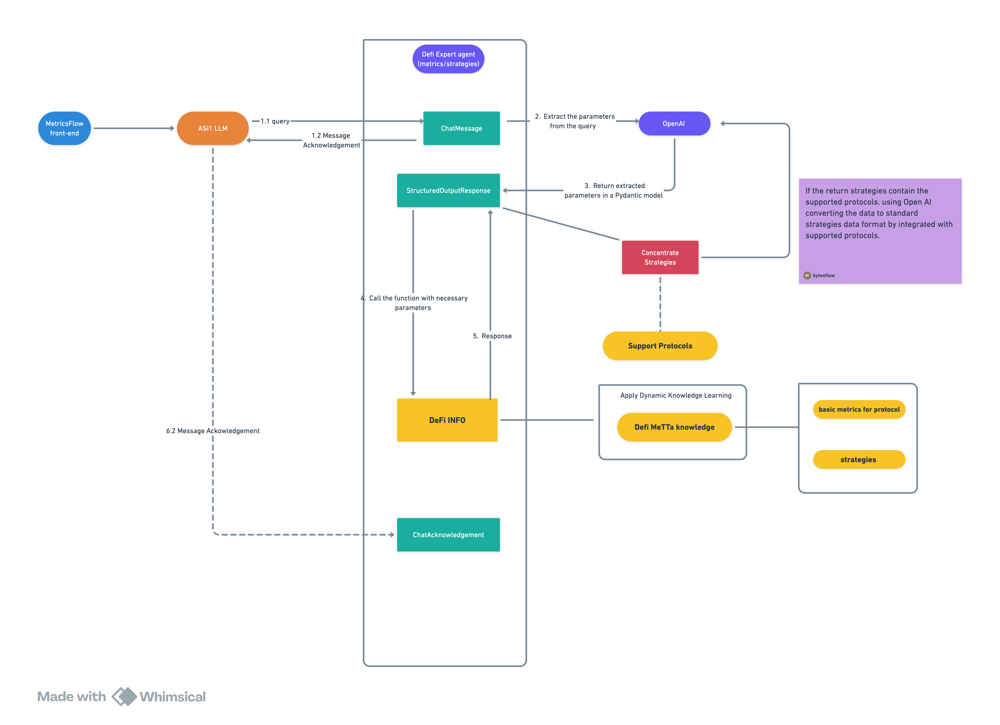

# OnChain Finance strategies Advisor Agent

Reference [singularity-net-metta-fetch-financial-advisor-agent](https://github.com/fetchai/innovation-lab-examples/tree/main/web3/singularity-net-metta-fetch-financial-advisor-agent)



## ⚙️ Setup Instructions

### Prerequisites

- Python 3.11+
- ASI:One API key

### Installation

1. **Clone the repository and enter metric-flow-ai-agent branck**

2. **Create virtual environment**:

   ```bash
   python -m venv venv
   source venv/bin/activate  # On Windows: venv\Scripts\activate
   ```

3. **Install dependencies**:

   ```bash
   pip install -r requirements.txt
   ```

4. **Set up environment variables**:
   To get the ASI:One API Key, login to https://asi1.ai/ and go to **Developer** section, click on **Create New** and copy your API Key. Please refer this [guide](https://innovationlab.fetch.ai/resources/docs/asione/asi-one-quickstart#step-1-get-your-api-key) for detailed steps.

   ```bash
   cp .env.example .env
   # Edit .env with your API keys
   ```

5. **Run the agent**:
   ```bash
   python agent.py
   ```

### Environment Variables

Create a `.env` file with:

```env
ASI_ONE_API_KEY=your_asi_one_api_key_here
```

## 🧪 Testing the Agent

1. **Start the agent**:

   ```bash
   python agent.py
   ```

2. **Access the inspector**:
   Visit the URL shown in the console (e.g., `https://agentverse.ai/inspect/?uri=http%3A//127.0.0.1%3A8008&address=agent1qd674kgs3987yh84a309c0lzkuzjujfufwxslpzygcnwnycjs0ppuauektt`) and click on `Connect` and select the `Mailbox` option. For detailed steps for connecting Agents via Mailbox, please refer [here](https://innovationlab.fetch.ai/resources/docs/agent-creation/uagent-creation#mailbox-agents).

3. **Test queries**:

### 🎯 Risk Profile & Investment Recommendations

- "I'm a conservative investor with low risk tolerance. What on Chain strategies should I consider?"
- "I have moderate risk tolerance and want balanced on-chain yields. What protocols do you recommend?"
- "I'm aggressive and want high-risk, high-reward DeFi strategies. What are my options?"

### 💰 Expected Returns & Performance

- "What returns can I expect from Aave lending?"
- "How much do yield farming strategies typically return?"
- "What's the expected return on GMX perpetual trading?"
- "What are the APY ranges for stablecoin liquidity provision?"

### 🏛️ Protocol-Specific Queries

- "What are the risks of using Uniswap v3 for liquidity provision?"
- "How does Yearn's vault strategy work and what metrics should I track?"
- "What operations are available on Morpho lending protocol?"
- "Tell me about Pendle's yield trading mechanism."

### 🎯 Goal-Oriented DeFi Planning

- "How should I structure my portfolio for passive income in DeFi?"
- "What's the best strategy for speculation in on-chain finance?"
- "I want to preserve wealth using DeFi. What are safe options?"
- "How should institutions approach DeFi treasury management?"

### Doing: looking for specific strategies

- "How should I structure my portfolio for passive income in DeFi? when supply the availiable strategies should based on your supported protocols."

### 📚 Educational & Safety Queries

- "What is impermanent loss and how do I avoid it?"
- "How do gas fees affect my DeFi returns?"
- "What are the common mistakes in yield farming?"
- "How do I protect myself from MEV sandwich attacks?"

### 🔰 User Level-Specific Questions

- "As a DeFi beginner, how much should I risk?"
- "What metrics should I analyze as a DeFi researcher?"
- "How do I optimize for MEV protection as a sophisticated trader?"
- "What's appropriate DeFi position sizing for institutions?"

## Test Agents using Chat with Agent button on Agentverse

The agent uses MeTTa knowledge graphs to provide structured on-chain finance advice based on:

- **Risk Profile Analysis** - Comprehensive risk assessment across conservative, moderate, and aggressive profiles for DeFi strategies
- **Expected Return Calculations** - Data-driven return projections for lending, yield farming, derivatives, and other on-chain investments
- **Protocol-Specific Guidance** - Detailed analysis of 13 major DeFi protocols including Aave, Uniswap, GMX, and Yearn
- **Goal-Oriented Planning** - Strategic recommendations for passive income, speculation, wealth preservation, and institutional treasury management
- **Educational Framework** - Multi-level learning content from beginner safety to advanced MEV strategies
- **Real-Time Metrics Integration** - On-chain data analysis through Envio indexing for informed decision making

## 📊 Knowledge Graph Structure

The MeTTa knowledge graph contains comprehensive on-chain finance relationships:

### Core Investment Framework

- **Risk Profiles → Investment Types** (conservative → lending, staking; aggressive → derivatives, perpetuals)
- **Investment Types → Risk Levels** (lending → "low risk, stable yield"; perpetuals → "very high risk, funding costs")
- **Investment Types → Expected Returns** (yield_farming → "10-50% annually"; staking → "3-12% annually")
- **Investment Goals → Strategies** (passive_income → "lending, staking"; speculation → "options, derivatives")

### Protocol-Specific Knowledge

- **Protocols → Types** (aave → lending, uniswap_v3 → amm, gmx → derivatives)
- **Protocols → Strategies** (yearn → yield_vaults, curve → stablecoin_lp, dydx → perpetuals)
- **Protocols → Risk Vectors** (uniswap_v3 → "slippage, impermanent loss, MEV")
- **Protocols → Available Metrics** (aave → "supply_rate, borrow_rate, liquidation_threshold")
- **Protocols → Operations** (gmx → "open_position, close_position, liquidate")

### Educational Content

- **On-Chain Trading 101** (gas_fees → "factor in transaction costs"; yield_chasing → "high APYs indicate extreme risk")
- **User-Level FAQs** (beginner → basic safety; institutional → treasury management)

### Data Sources & Networks

- **Network Support** (Arbitrum)

## 🔗 Useful Links
