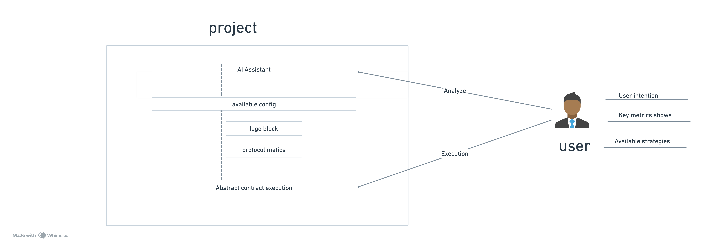

## Background

The DeFi market has matured significantly with the emergence of diverse protocols including AMMs, lending platforms, route aggregators, and automated yield optimization strategies. However, significant gaps remain for both retail and institutional users, from beginners to experienced traders.

The proliferation of protocols within each category creates increasing complexity. Even within the same protocol type, mechanisms can vary substantially - for instance, Uniswap v3's introduction of concentrated liquidity fundamentally changed AMM dynamics. This complexity creates substantial barriers for newcomers.

Cross-chain functionality remains a persistent challenge. Liquidity fragmentation across different blockchains increases execution costs and complicates optimal strategy selection, even for experienced users and institutions.

While attractive yield opportunities exist across various protocols, users face persistent risks including smart contract vulnerabilities, extreme market conditions, and malicious projects that can result in significant losses.

Given the conceptual complexity and dynamic market conditions, even institutional investors and seasoned traders struggle to effectively analyze risk-return profiles and execute custom strategies efficiently.

All of these factors create barriers to wider on-chain finance adoption.

## Solution

This protocol empowers users and institutions to develop comprehensive understanding of their risk profiles and investment strategies. By leveraging AI-driven analysis of real-time market data and sophisticated protocol metrics, users can dynamically assess risks and opportunities across DeFi protocols. The platform provides modular DeFi building blocks that enable users to construct customized strategies aligned with their specific objectives.

**For Researchers**: Construct sophisticated strategies using primitive building blocks or advanced composable modules, with simulation capabilities to validate research hypotheses and strategy performance.

**For Beginners**: Access intuitive metrics and educational tools that demystify DeFi mechanisms, providing clear risk-return analysis to facilitate informed decision-making and learning progression.

**For Experienced Users**: Monitor existing strategies with real-time protocol metrics, identify emerging opportunities, and optimize risk-adjusted returns through advanced analytics.

**For Institutions**: Deploy customized strategy modules tailored to institutional requirements, such as capital preservation, stable yield generation, or risk-controlled growth strategies for large-scale deployments.

## Core Features

### 1. AI-Powered Strategy Assistant

Leveraging comprehensive protocol metrics and real-time market data, the AI assistant provides personalized strategy recommendations based on user intent and risk preferences. Rather than offering black-box solutions, the system provides transparent explanations of underlying mechanisms, risk factors, and expected outcomes, enabling informed decision-making.

### 2. Key metrics

Protocol-specific metrics dashboard displaying critical performance indicators tailored to each DeFi category:

- **AMMs**: Slippage tolerance, price impact, liquidity depth, volume trends
- **Lending Protocols**: Utilization rates, borrowing costs, liquidation thresholds, reserve factors
- **Yield Farms**: APY breakdown, impermanent loss risk, token emission schedules
- **Cross-chain Bridges**: Transfer fees, confirmation times, security audits

### 3. Modular DeFi Building Blocks

| Component               | Function                        | Example Protocols        | Required Inputs              | Generated Outputs              | Primary Risk Vectors            |
| ----------------------- | ------------------------------- | ------------------------ | ---------------------------- | ------------------------------ | ------------------------------- |
| **Token Swap**          | Execute atomic token exchanges  | Uniswap, Curve, Maverick | Token pair, amount, slippage | Swapped tokens, tx receipt     | Slippage, MEV, price impact     |
| **Lending Position**    | Supply assets for yield         | Aave, Compound, Morpho   | Asset, amount, duration      | Interest-bearing tokens        | Protocol risk, rate volatility  |
| **Borrowing Position**  | Access leverage via collateral  | Aave, Compound, Euler    | Collateral, target asset     | Borrowed assets, debt position | Liquidation, interest rate risk |
| **Liquidity Provision** | Provide DEX liquidity           | Uniswap, Curve, Balancer | Token pair, amounts, range   | LP tokens, fee earnings        | Impermanent loss, range risk    |
| **Yield Optimization**  | Automated strategy execution    | Yearn, Convex, Pendle    | Base asset, strategy type    | Strategy tokens, rewards       | Smart contract, strategy risk   |
| **Derivatives Trading** | Directional exposure management | GMX, Synthetix, dYdX     | Collateral, position size    | Leveraged position             | Liquidation, funding costs      |

cross-chain plugin if needed

### 4. Simple and efficient execution

Apply Account Abstraction (EIP-4337) to simplify complex smart contract interactions and help users efficiently execute their strategies.
