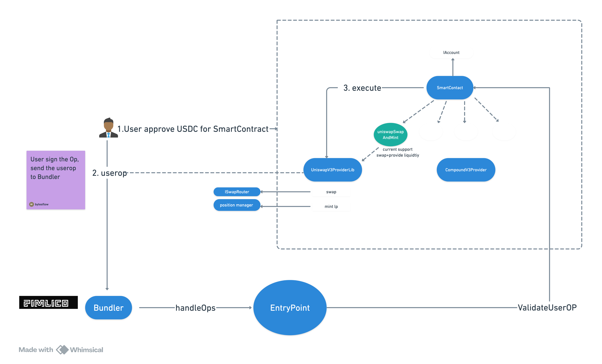

# Smart Conrtract

Apply Abstract contract(EIP437), defining the custom operation(now support uniswap-v3 swap+provide liqudiity). User can sign the operation, then send the Op to the bundler witout paying gas.

Currently, only Uniswap V3 swapAndMint is supported.
The price range is set to [P-10%P ,P+10%P](P = current price).
The liquidity allocation uses 50% of total USDC and 50% of total USDC converted to ETH.

## Desgin

## SmartContract

[SmartContract](https://arbiscan.io/address/0x99D99380e034032de885C69aF429B769A6D048b9)

[TX-swapAndmint](https://arbiscan.io/tx/0xb81c44807df6be0b7aaa4c47715c0c4d286d0dc0f6d257b827a948579af72c2d)

## Set up

1. forge install
2. forge test(apply arbitrium forked test)
   `forge test --match-test testUniswapSwapAndMint -vv`

## Todo

1. Combine the approve function with the swapAndMint function.
2. Implement the validateUserOp function, which should use EIP-712.
3. For more sophisticated operations, consider using the proxy pattern to delegate additional functionalities.
4. Refactor the smart contract to be compatible with cross-chain operations.

## Materials

1. Reference [mastering-account-abstraction](https://medium.com/%40emirhancavusoglu/mastering-account-abstraction-a-step-by-step-guide-ce80219779c4)
2. https://www.pimlico.io/
